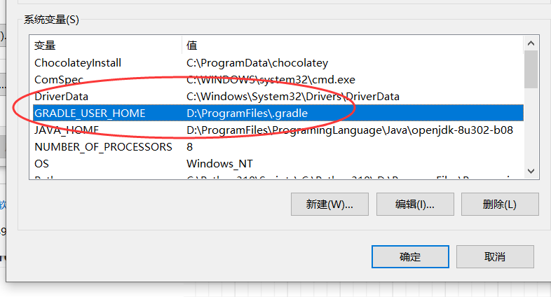
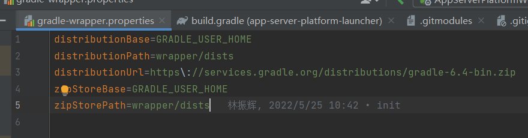
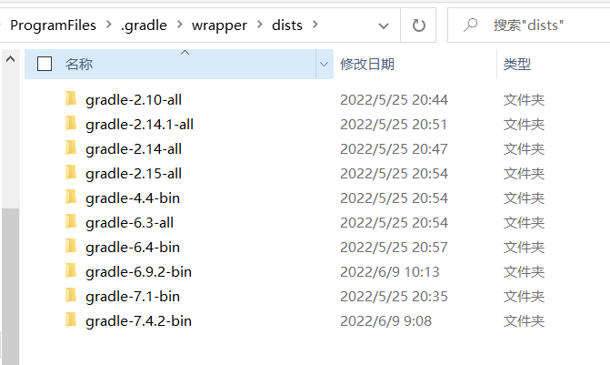
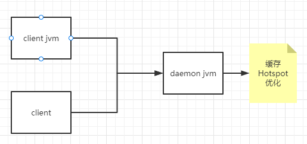
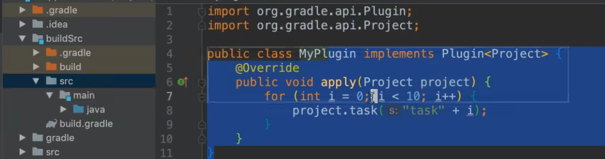

# Gradle

## 运行gradle

### gradle_user_home

* 文件结构

```
.tmp
build-scan-data
caches  底下的\modules-2\files-2.1 -->类似maven 的.m2文件夹
daemon
jdks
native
notifications
workers
wrapper

```

* 全局设置gradle_user_home

window可以在 环境变量中配置。



这样配置后，使用gradle wrapper的下载的内容都会存在这个文件夹中。方便查找

### wrapper

下载对应版本的gradle。防止gradle 版本不一致导致的问题，主要配置是在wrapper底下的gradle-wrapper.properties文件中



各项属性的整体含义，如下：

（1） 去 https\://services.gradle.org/distributions/gradle-6.4-bin.zip 下载gradle的6.4版本，只包含binary的版本。

（2） 下载的gradle-6.4-bin.zip存放到${GRADLE_USER_HOME}\wrapper\dists目录中。

（3） 解压gradle-6.4-bin.zip.





### daemon（守护进程）



#### Gradle Daemon 如何使构建更快

​		Gradle 守护进程是一个*长期存在*的构建过程。在构建之间，它空闲地等待下一个构建。这有一个明显的好处，即多个构建只需要一次将 Gradle 加载到内存中，而不是每个构建一次。

#### 禁用守护程序

​		Gradle 守护程序默认启用，我们建议始终启用它。您可以通过命令行选项`--no-daemon`或添加`org.gradle.daemon=false`到您的文件来禁用长期存在的 Gradle 守护程序`gradle.properties`

### 常见命令

>  格式

`gradle [taskName...] [--option-name...]`

> 多项目

`gradle :my-subproject:taskName` 

> 设置日志级别

您可以使用以下选项自定义 Gradle 日志记录的详细程度，从最不详细到最详细排序。[在日志记录文档](https://docs.gradle.org/current/userguide/logging.html#logging)中了解更多信息。

- `-Dorg.gradle.logging.level=(quiet,warn,lifecycle,info,debug)`

  通过 Gradle 属性设置日志记录级别。

- `-q`,`--quiet`

  仅记录错误。

- `-w`,`--warn`

  将日志级别设置为警告。

- `-i`,`--info`

  将日志级别设置为信息。

- `-d`,`--debug`

> 其他

* 列出项目依赖项

`gradle dependencies`

* 可视化扫描

`gradle build --scan` 

* 列出依赖版本号管理

gradle dependencyManagement

ex: https://scans.gradle.com/s/ghfzki72w6tpe

官方地址 https://docs.gradle.org/current/userguide/command_line_interface.html#common_tasks

## 编写 gradle构建

### gradle生命周期

* 初始化 

 setting.gradle 各个模块项目的实例化

```
rootProject.name = 'app-server-platform-launcher'

include 'xxx'
```

* 配置

 从上到下执行build.gradle  有buildscript先执行buildscript的内容

```
buildscript {

}
/**
 * 所有项目公共资源（此文件所在位置底下所有项目，包含根项目）
 */
allprojects {

}
/**
 * 子项目通用配置
 */
subprojects {

}
```

* 执行

Gradle 确定在配置阶段创建和配置的要执行的任务子集。该子集由传递给`gradle`命令和当前目录的任务名称参数确定。Gradle 然后执行每个选定的任务。（compile java）

**钩子函数**


### 动态改变Task依赖关系

有时我们需要在一个已有的构建系统中插入我们自己的构建任务，比如在执行Java构建后我们想要删除构建过程中产生的临时文件，那么我们就可以自定义一个名叫cleanTemp的任务，让其依赖于build任务，然后调用cleanTemp任务即可。 但是这种方式适用范围太小，比如在使用IDE执行构建时，IDE默认就是调用build任务，我们没法修改IDE的行为，所以我们需要将自定义的任务插入到原有的任务关系中。

1. **寻找插入点** 如果你对一个构建的任务依赖关系不熟悉的话，可以使用一个插件来查看，在根项目的build.gradle中添加如下代码:

```
buildscript {
  repositories {
    maven {
      url "https://plugins.gradle.org/m2/"
    }
  }
  dependencies {
    classpath "gradle.plugin.com.dorongold.plugins:task-tree:1.2.2"
  }
}
apply plugin: "com.dorongold.task-tree"
复制代码
```

然后执行`gradle <任务名> taskTree --no-repeat`，即可看到指定Task的依赖关系，比如在Java构建中查看build任务的依赖关系：

```
:build
+--- :assemble
|    \--- :jar
|         \--- :classes
|              +--- :compileJava
|              \--- :processResources
\--- :check
     \--- :test
          +--- :classes *
          \--- :testClasses
               +--- :compileTestJava
               |    \--- :classes *
               \--- :processTestResources
复制代码
```

我们看到build主要执行了assemble包装任务和check测试任务，那么我们可以将我们自定义的cleanTemp插入到build和assemble之间。 

2. **动态插入自定义任务** 我们先定义一个自定的任务cleanTemp，让其依赖于assemble。

```
task cleanTemp(dependsOn: assemble) {
  doLast {
    println '清除所有临时文件'
  }
}

```

接着，我们将cleanTemp添加到build的依赖项中。

```
afterEvaluate {
  build.dependsOn cleanTemp
}

```

注意，**dependsOn方法只是添加一个依赖项，并不清除之前的依赖项**，所以现在的依赖关系如下：

```
:build
+--- :assemble
|    \--- :jar
|         \--- :classes
|              +--- :compileJava
|              \--- :processResources
+--- :check
|    \--- :test
|         +--- :classes
|         |    +--- :compileJava
|         |    \--- :processResources
|         \--- :testClasses
|              +--- :compileTestJava
|              |    \--- :classes
|              |         +--- :compileJava
|              |         \--- :processResources
|              \--- :processTestResources
\--- :cleanTemp
     \--- :assemble
          \--- :jar
               \--- :classes
                    +--- :compileJava
                    \--- :processResources

```

可以看到，cleanTemp依赖于assemble，同时build任务多了一个依赖，而build和assemble原有的依赖关系并没有改变，执行`gradle build`后任务调用结果如下：

```
:compileJava UP-TO-DATE
:processResources UP-TO-DATE
:classes UP-TO-DATE
:jar UP-TO-DATE
:assemble UP-TO-DATE
:compileTestJava UP-TO-DATE
:processTestResources UP-TO-DATE
:testClasses UP-TO-DATE
:test UP-TO-DATE
:check UP-TO-DATE
:cleanTemp
清除所有临时文件
:build

BUILD SUCCESSFUL
```


### 插件编写

约定项目底下的buildSrc模块编写



