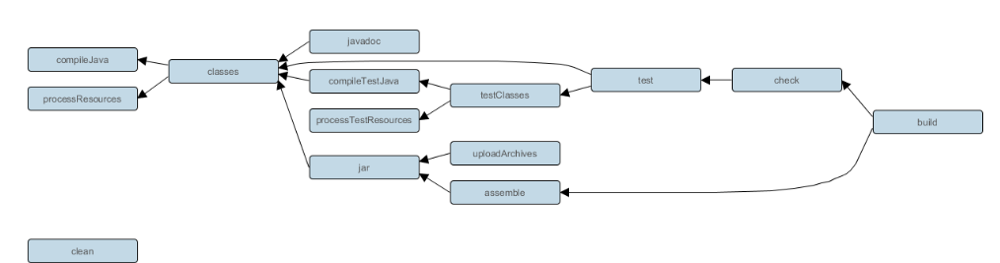
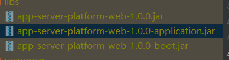

# gradle在java应用





### 自带插件介绍

* java

https://docs.gradle.org/current/userguide/java_plugin.html#java_plugin

提供 assembly build jar 等任务的功能

* java-library

相比于java插件增加了api 接口

https://docs.gradle.org/current/userguide/java_library_plugin.html

* application

​		Application 插件有助于创建可执行的 JVM 应用程序。它可以在开发过程中轻松地在本地启动应用程序，并将应用程序打包为 TAR 和/或 ZIP，包括操作系统特定的启动脚本。

​		包含java 插件和Distribution插件

* java-platform

Java 平台插件带来了为 Java 生态系统声明平台的能力。一个平台可以用于不同的目的：

1. 发布的模块的描述（例如，共享相同的版本）
2. 一组库的推荐版本。一个典型的例子包括[Spring Boot BOM](https://docs.spring.io/spring-boot/docs/current/reference/html/using-boot-build-systems.html#using-boot-dependency-management)
3. 在子项目之间[共享一组依赖版本](https://docs.gradle.org/6.0.1/userguide/java_platform_plugin.html#sec:java_platform_consumption)

​		

### 动态改变Task依赖关系

有时我们需要在一个已有的构建系统中插入我们自己的构建任务，比如在执行Java构建后我们想要删除构建过程中产生的临时文件，那么我们就可以自定义一个名叫cleanTemp的任务，让其依赖于build任务，然后调用cleanTemp任务即可。 但是这种方式适用范围太小，比如在使用IDE执行构建时，IDE默认就是调用build任务，我们没法修改IDE的行为，所以我们需要将自定义的任务插入到原有的任务关系中。

1. **寻找插入点** 如果你对一个构建的任务依赖关系不熟悉的话，可以使用一个插件来查看，在根项目的build.gradle中添加如下代码:

```
buildscript {
  repositories {
    maven {
      url "https://plugins.gradle.org/m2/"
    }
  }
  dependencies {
    classpath "gradle.plugin.com.dorongold.plugins:task-tree:1.2.2"
  }
}

```

然后执行`gradle <任务名> taskTree --no-repeat`，即可看到指定Task的依赖关系，比如在Java构建中查看build任务的依赖关系：

```
:build
+--- :assemble
|    \--- :jar
|         \--- :classes
|              +--- :compileJava
|              \--- :processResources
\--- :check
     \--- :test
          +--- :classes *
          \--- :testClasses
               +--- :compileTestJava
               |    \--- :classes *
               \--- :processTestResources

```

我们看到build主要执行了assemble包装任务和check测试任务，那么我们可以将我们自定义的cleanTemp插入到build和assemble之间。 2. **动态插入自定义任务** 我们先定义一个自定的任务cleanTemp，让其依赖于assemble。

```
task cleanTemp(dependsOn: assemble) {
  doLast {
    println '清除所有临时文件'
  }
}

```

接着，我们将cleanTemp添加到build的依赖项中。

```
afterEvaluate {
  build.dependsOn cleanTemp
}

```

注意，**dependsOn方法只是添加一个依赖项，并不清除之前的依赖项**，所以现在的依赖关系如下：

```
:build
+--- :assemble
|    \--- :jar
|         \--- :classes
|              +--- :compileJava
|              \--- :processResources
+--- :check
|    \--- :test
|         +--- :classes
|         |    +--- :compileJava
|         |    \--- :processResources
|         \--- :testClasses
|              +--- :compileTestJava
|              |    \--- :classes
|              |         +--- :compileJava
|              |         \--- :processResources
|              \--- :processTestResources
\--- :cleanTemp
     \--- :assemble
          \--- :jar
               \--- :classes
                    +--- :compileJava
                    \--- :processResources

```

可以看到，cleanTemp依赖于assemble，同时build任务多了一个依赖，而build和assemble原有的依赖关系并没有改变，执行`gradle build`后任务调用结果如下：

```
:compileJava UP-TO-DATE
:processResources UP-TO-DATE
:classes UP-TO-DATE
:jar UP-TO-DATE
:assemble UP-TO-DATE
:compileTestJava UP-TO-DATE
:processTestResources UP-TO-DATE
:testClasses UP-TO-DATE
:test UP-TO-DATE
:check UP-TO-DATE
:cleanTemp
清除所有临时文件
:build

BUILD SUCCESSFUL
```


## springboot插件

### 介绍

#### org.springframework.boot

**打包可执行jar包**

```
bootJar {
    enabled = true  //是否打包
    archiveClassifier = 'boot'  //配置文件名最后部分，如下图，写成boot application和不写的区别
    mainClass = 'com.example.ExampleApplication' // 也可以使用任务的mainClass属性显式配置主类：
}
jar{
	enabled = false //如果不想打出普通的jar包
}
bootWar {
    enabled = true
    archiveClassifier = 'boot'
    mainClass = 'com.example.ExampleApplication' // 也可以使用任务的mainClass属性显式配置主类：
}
```



#### io.spring.dependency-management

**使用依赖管理插件管理依赖**

当你应用[`io.spring.dependency-management`](https://github.com/spring-gradle-plugins/dependency-management-plugin)插件时，Spring Boot 的插件会自动从你正在使用的 Spring Boot 版本中[导入`spring-boot-dependencies`bom](https://docs.spring.io/spring-boot/docs/current/gradle-plugin/reference/htmlsingle/#reacting-to-other-plugins.dependency-management)。这提供了与 Maven 用户所享受的类似的依赖管理体验。例如，它允许您在声明在 bom 中管理的依赖项时省略版本号。要使用此功能，请以通常的方式声明依赖项，但省略版本号：

> Gradle通过io.spring.dependency-management插件实现类Maven的依赖管理方式

```xml
plugins {
    // the Gradle plugin which provides the “dependencyManagement” block
    id 'io.spring.dependency-management' version '1.0.6.RELEASE'
    // add Java build functionality to be able to follow the Vaadin guide
    id 'java'
}

dependencyManagement {
    imports {
        // the Maven BOM which contains a coherent set of module versions
        // for Vaadin dependencies
        mavenBom 'com.vaadin:vaadin-bom:10.0.11'
    }
}

repositories {
    // find dependency modules on Maven Central
    mavenCentral()
}

dependencies {
    // the dependency module you need according to the Vaadin with
    // Spring Boot guide; the version of the module is taken from the
    // imported BOM; transitive dependencies are automatically taken
    // care of by Gradle (just as with Maven)
    compile 'com.vaadin:vaadin-spring-boot-starter'
}

```

**查看依赖项的版本**

可以使用`gradle dependencyManagement`查看

**自定义托管版本**

应用依赖管理插件时自动导入的`spring-boot-dependencies`bom 使用属性来控制它管理的依赖的版本。浏览[`Dependency versions Appendix`](https://docs.spring.io/spring-boot/docs/2.7.0/reference/htmlsingle/#dependency-versions-properties)Spring Boot 参考中的这些属性的完整列表。

要自定义托管版本，请设置其相应的属性。例如，要自定义由`slf4j.version`属性控制的 SLF4J 的版本：

```groovy
ext['slf4j.version'] = '1.7.20'
```

  每个 Spring Boot 版本都针对一组特定的第三方依赖项进行设计和测试。覆盖版本可能会导致兼容性问题，应小心操作

### 引入

```groovy
buildscript {
    repositories {
        mavenLocal()

    }
    dependencies {
        classpath("org.springframework.boot:spring-boot-gradle-plugin:${springBootVersion}")
        classpath("io.spring.gradle:dependency-management-plugin:${springBootManagementVersion}")
    }
}
```

为了底下 的配置可以马上用到，我们可以在buildscript 中引入

### 官网

https://docs.spring.io/spring-boot/docs/current/gradle-plugin/reference/htmlsingle/#introduction