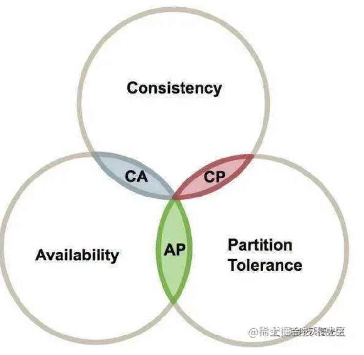
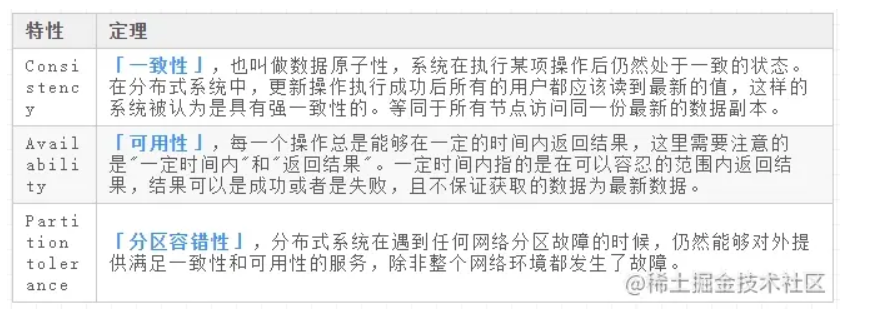

# 原则与 BASE 理论

## 一、CAP 原则

CAP 原则又称 CAP 定理，指的是在一个分布式系统中， Consistency（一致性）、 Availability（可用性）、Partition tolerance（分区容错性），三者不可得兼。

CAP 由 Eric Brewer 在 2000 年 PODC 会议上提出。该猜想在提出两年后被证明成立，成为我们熟知的 CAP 定理。CAP 三者不可兼得。

### 1、取舍策略

CAP 三个特性只能满足其中两个，那么取舍的策略就共有三种：

- **「CA without P」**：如果不要求 P（不允许分区），则 C（强一致性）和 A（可用性）是可以保证的。但放弃 P 的同时也就意味着放弃了系统的扩展性，也就是分布式节点受限，没办法部署子节点，这是违背分布式系统设计的初衷的。
- **「CP without A」**：如果不要求 A（可用），相当于每个请求都需要在服务器之间保持强一致，而 P（分区）会导致同步时间无限延长（也就是等待数据同步完才能正常访问服务），一旦发生网络故障或者消息丢失等情况，就要牺牲用户的体验，等待所有数据全部一致了之后再让用户访问系统。设计成 CP 的系统其实不少，最典型的就是分布式数据库，如 Redis、HBase 等。对于这些分布式数据库来说，数据的一致性是最基本的要求，因为如果连这个标准都达不到，那么直接采用关系型数据库就好，没必要再浪费资源来部署分布式数据库。
- **「AP without C」**：要高可用并允许分区，则需放弃一致性。一旦分区发生，节点之间可能会失去联系，为了高可用，每个节点只能用本地数据提供服务，而这样会导致全局数据的不一致性。典型的应用就如某米的抢购手机场景，可能前几秒你浏览商品的时候页面提示是有库存的，当你选择完商品准备下单的时候，系统提示你下单失败，商品已售完。这其实就是先在 A（可用性）方面保证系统可以正常的服务，然后在数据的一致性方面做了些牺牲，虽然多少会影响一些用户体验，但也不至于造成用户购物流程的严重阻塞。

### 2、总结

现如今，对于多数大型互联网应用的场景，主机众多、部署分散，而且现在的集群规模越来越大，节点只会越来越多，所以节点故障、网络故障是常态，因此**「分区容错性」**也就成为了一个分布式系统必然要面对的问题。那么就只能在 C 和 A 之间进行取舍。但对于传统的项目就可能有所不同，拿银行的转账系统来说，涉及到金钱的对于数据一致性不能做出一丝的让步，C 必须保证，出现网络故障的话，宁可停止服务，可以在 A 和 P 之间做取舍。而互联网非金融项目普遍都是基于 AP 模式。

总而言之，没有最好的策略，好的系统应该是根据业务场景来进行架构设计的，只有适合的才是最好的。

## 二、BASE 理论

CAP 理论已经提出好多年了，难道真的没有办法解决这个问题吗？也许可以做些改变。比如 C 不必使用那么强的一致性，可以先将数据存起来，稍后再更新，实现所谓的 “最终一致性”。

这个思路又是一个庞大的问题，同时也引出了第二个理论 BASE 理论。

> BASE：全称 Basically Available（基本可用），Soft state（软状态），和 Eventually consistent（最终一致性）三个短语的缩写，来自 ebay 的架构师提出。

BASE 理论是对 CAP 中一致性和可用性权衡的结果，其来源于对大型互联网分布式实践的总结，是基于 CAP 定理逐步演化而来的。其核心思想是：

> 既然无法做到强一致性（Strong consistency），但每个应用都可以根据自身的业务特点，采用适当的方式来使系统达到最终一致性（Eventual consistency）。

### 1、Basically Available（基本可用）

基本可用是指分布式系统在出现故障的时候，允许损失部分可用性（例如响应时间、功能上的可用性）。需要注意的是，基本可用绝不等价于系统不可用。

- 响应时间上的损失：正常情况下搜索引擎需要在 0.5 秒之内返回给用户相应的查询结果，但由于出现故障（比如系统部分机房发生断电或断网故障），查询结果的响应时间增加到了 1~2 秒。
- 功能上的损失：购物网站在购物高峰（如双十一）时，为了保护系统的稳定性，部分消费者可能会被引导到一个降级页面。

### 2、Soft state（软状态）

什么是软状态呢？相对于原子性而言，要求多个节点的数据副本都是一致的，这是一种 “硬状态”。

软状态是指允许系统存在中间状态，而该中间状态不会影响系统整体可用性。分布式存储中一般一份数据会有多个副本，允许不同副本数据同步的延时就是软状态的体现。

### 3、Eventually consistent（最终一致性）

系统不可能一直是软状态，必须有个时间期限。在期限过后，应当保证所有副本保持数据一致性。从而达到数据的最终一致性。这个时间期限取决于网络延时，系统负载，数据复制方案设计等等因素。

实际上，不只是分布式系统使用最终一致性，关系型数据库在某个功能上，也是使用最终一致性的，比如备份，数据库的复制都是需要时间的，这个复制过程中，业务读取到的值就是旧值。当然，最终还是达成了数据一致性。这也算是一个最终一致性的经典案例。

**点击获取[spring 微服务架构视频教程](https://link.juejin.cn?target=https%3A%2F%2Fitem.taobao.com%2Fitem.htm%3Fspm%3Da2oq0.12575281.0.0.6e441debz8IuD2%26ft%3Dt%26id%3D618747445832)学习资料。**

## 三、总结

总的来说，BASE 理论面向的是大型高可用可扩展的分布式系统，和传统事务的 ACID 是相反的，它完全不同于 ACID 的强一致性模型，而是通过牺牲强一致性来获得可用性，并允许数据在一段时间是不一致的。

链接：https://juejin.cn/post/6844904202276175879
